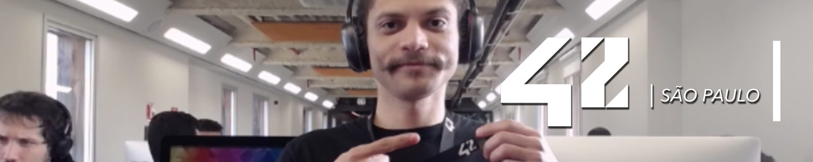

# 🏢 42sp

<picture>

</picture>
<picture>
	<source srcset="https://img.shields.io/badge/Linux-OS?&label=OS&labelColor=gray&color=dodgerblue" media="(min-width: 600px)">
	<source srcset="https://img.shields.io/badge/Linux-OS?&label=OS&labelColor=gray&color=dodgerblue" media="(min-width: 400px)">
	
</picture>
<picture>
	<source srcset="https://img.shields.io/badge/Shell_|_C-Language?&label=Language&labelColor=gray&color=dodgerblue" media="(min-width: 600px)">
	<source srcset="https://img.shields.io/badge/Shell_|_C-Language?&label=Language&labelColor=gray&color=dodgerblue" media="(min-width: 400px)">
	
</picture>
<picture>
	<source srcset="https://img.shields.io/badge/WIP-Status?&label=Status&labelColor=gray&color=yellow" media="(min-width: 600px)">
	<source srcset="https://img.shields.io/badge/WIP-Status?&label=Status&labelColor=gray&color=yellow" media="(min-width: 400px)">
	
</picture>

## 🏅 Projects

<h4>
	Basecamp Feb/2022:
</h4>

<h4>
	Piscine Jun/2023:
</h4>

<h4>
	Piscine Reloaded Jul/2023:
</h4>

<h4>
	42 Cursus - Phase one - Aug/2023:
</h4>

##

	<picture>
		<source srcset="./img/wild_duck.png" media="(min-height: 40px)">
		<source srcset="./img/wild_duck.png" media="(min-height: 25px)">
		
	</picture>

